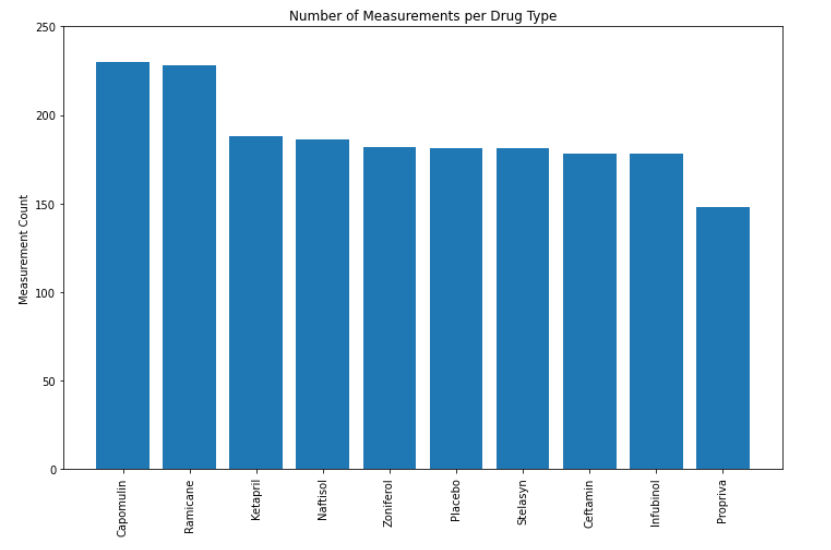

# Pymaceuticals

## Summary

A company wants to analyze the results of several different cancer treatment medications on a large group of sample mice.  The data is not organized in any particular way with the various observations done for each mouse throught their treatment. Data cleanup must be done before plotting the results of of the experiment and making observations.

## Pymaceuticals 

249 mice with a variety of tumor treatments were tested for a particular duration.  There is a small amount of duplicates that need to be filtered out in order to get a good amount of 

The results will include:

### Number of Measurements
  *

### Tumor statistics 
  * Mean
  * Median
  * Variance
  * Standard Deviation
  * Standard Error

