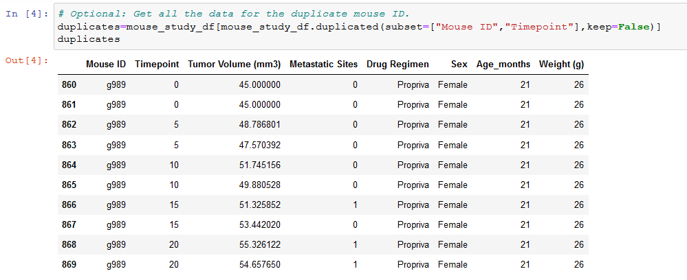
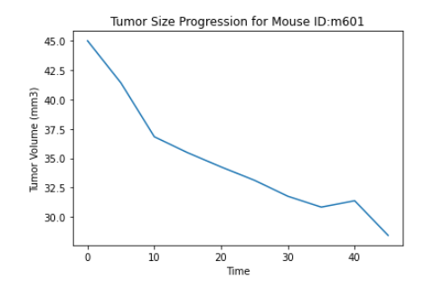

# Pymaceuticals

## Summary

A company wants to analyze the results of several different cancer treatment medications on a large group of sample mice.  The data is not organized in any particular way with the various observations done for each mouse throught their treatment. Data cleanup must be done before plotting the results of of the experiment and making observations.

### Folder Structure for the Project is as follows
* Main - Where the main Jupyter notebook and this file are located.
  * Images - Result images for this file.
  * data - Folder including observation data and mouse metadata.

## Pymaceuticals 

249 mice with a variety of tumor treatments were tested for a particular duration.  There is a small amount of duplicates that need to be filtered out in order to get a good amount of 

The results will include:

### Number of Measurements
  * Grouped by Drug Type

### Tumor statistics 
  * Mean
  * Median
  * Variance
  * Standard Deviation
  * Standard Error

### Mouse Gender Count

### Boxplot Statistics for all Medicines

### Treatment projections for a single mouse

### Relation Between Tumor Size and Mouse Weight

